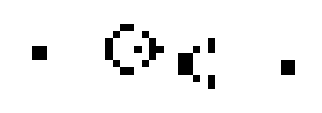
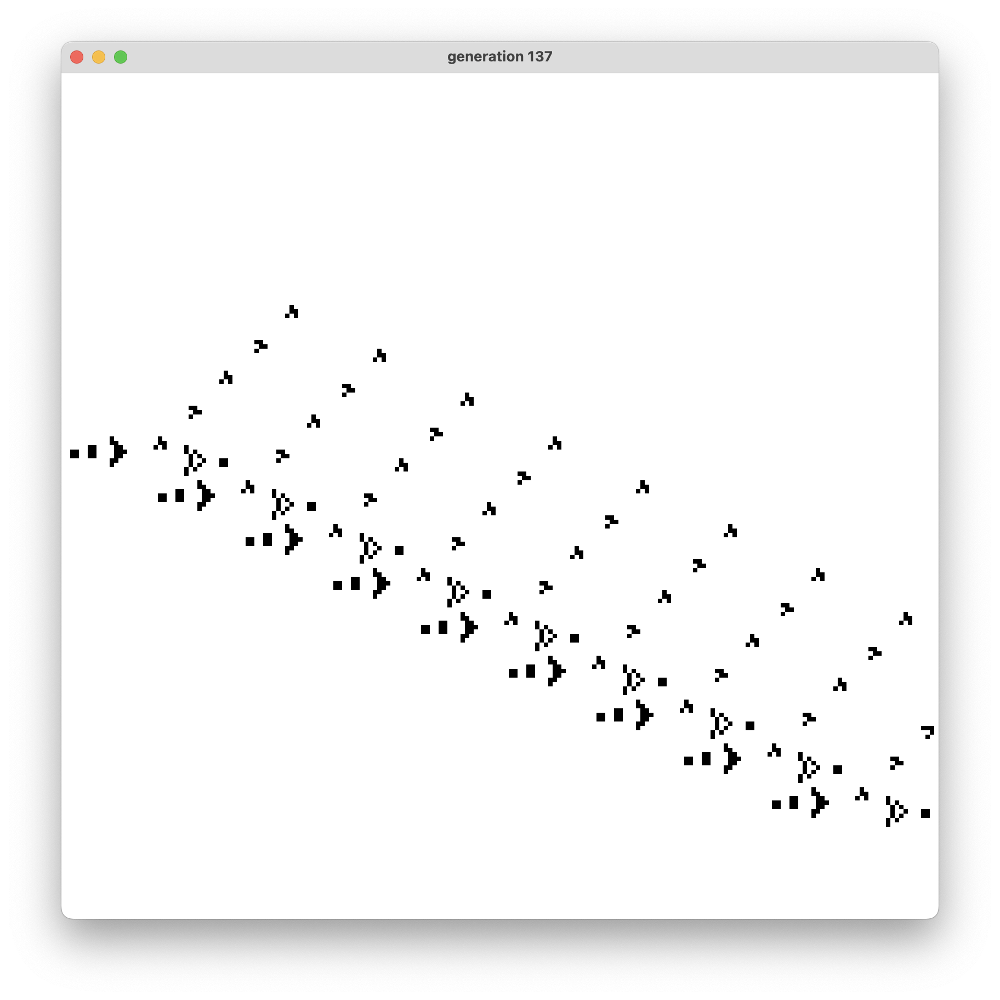

## 🧬 Conway's Game of Life — Glider Gun Simulation Tutorial 
n this example, we'll simulate multiple glider guns using the classic Conway's Game of Life rules, which demonstrate how simple rules can create complex, fascinating behavior.

### Step 1: Define the Glider Gun Pattern
A glider gun is a special pattern that periodically emits "gliders"—small structures that move diagonally across the grid. The most famous is the Gosper Glider Gun, which creates a new glider every 30 generations.
<p align="center">
  
</p>

We define the pattern as a list of coordinate pairs where the cells should be initially alive:

``` java
int[][] gliderGun = new int[][]{
    {0,3},{0,4},{1,3},{1,4},
    {10,2},{10,3},{10,4},{11,1},{12,0},{13,0},{11,5},{12,6},{13,6},{14,3},{16,3},{17,3},{16,2},{16,4},{15,1},{15,5},
    {20,4},{20,5},{21,4},{21,5},{20,6},{21,6},{22,7},{22,3}, {24,7}, {24,8},{24,3},{24,2},
    {24+10,5},{25+10,5},{24+10,6},{25+10,6}};
```


## Step 2: Add Glider Guns to the Grid
We’ll place multiple glider guns diagonally across the grid using the ``applyPattern`` method from our ``CellularAutomaton2D`` class.

``` java
// Adding 9 glider guns in diagonal
for(int i = 0; i < 9; ++i){
    gameOfLife.applyPattern(new int[]{2 + 20 * i, 90 + 10 * i}, gliderGun);
}
```


## Step 3: Delay Before Starting the Simulation (Optional)
Adding a small delay before the simulation starts can be useful for setup or debugging.

``` java
try{
    Thread.sleep(1_000);
}
catch (Exception e){
    System.out.println(e.getLocalizedMessage());
}

while(true){
    gameOfLife.refresh();
}
```


## Step 4: Start simulation
Use a loop to continuously refresh the simulation. This is the core loop where the grid updates frame by frame.

``` java
while(true){
    gameOfLife.refresh();
}
```


## Step 5: Full Working Code
Combining all the steps above, here's the complete example:
``` java
public class Main
{ 
    public static void main(String[] args)
    {
        CellularAutomaton2D gameOfLife = new CellularAutomaton2D(800, RulesList.CONWAY_GAME_OF_LIFE);
        
        int[][] gliderGun = new int[][]{{0,3},{0,4},{1,3},{1,4},
                                        {10,2},{10,3},{10,4},{11,1},{12,0},{13,0},{11,5},{12,6},{13,6},{14,3},{16,3},{17,3},{16,2},{16,4},{15,1},{15,5},
                                        {20,4},{20,5},{21,4},{21,5},{20,6},{21,6},{22,7},{22,3}, {24,7}, {24,8},{24,3},{24,2},
                                        {24+10,5},{25+10,5},{24+10,6},{25+10,6}};

        // Adding 9 glider guns in diagonal
        for(int i = 0; i < 9; ++i){
            gameOfLife.applyPattern(new int[]{2 + 20 * i, 90 + 10 * i}, gliderGun);
        }

        // pause for 1 second
        try{
            Thread.sleep(1_000);
        }
        catch (Exception e){
            System.out.println(e.getLocalizedMessage());
        }

        while(true){
            gameOfLife.refresh();
        }
    }
}
```

<p align="center">
  
  <br>
  <em>Screen shot of the 137 generation.</em>
</p>
